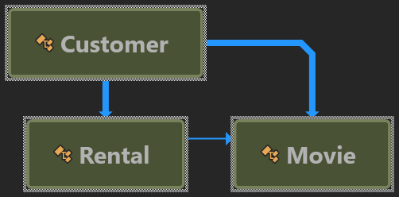

# Refactoring: Improving the Design of Existing Code in C#

This repository contains exercise codes from the book [Refactoring - Improving the Design of Existing Code](https://www.amazon.co.uk/Refactoring-Improving-Design-Existing-Technology/dp/0201485672). It will help you get started with the exercises in C# while reading the book.

> Any fool can write a code that a computer can understand. Good programmers write code that humans can understand.

## Chapter 1:

### When to refactoring: 

You have a requirement to make changes on the exiting code, but the code is not structured and easy to add new features. In such scenarios, first refactor the code to add the new feature, then add new feature.

### First step of refactoring:

It's easy to introduce bugs while making refactoring the existing code, so always ensure that the exiting code covered with solid testcases so that it will indicate the issues immediatly when we introduce defects.

### Video Store: Intial Class Diagram

### Refactoring Recipes

Always refactor the code in small steps so that when you make a mistake, it's easy to find the bug. to find the bug.

* Extract Method
* Move Method
* Replace Temp with Query